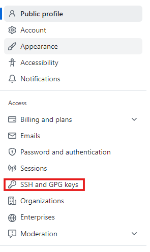

## 設問

`Github` への `sshキー` の登録を行うマニュアルを `manual` ディレクトリに `Markdown` 文書として格納してください。

## 回答

### 1. `sshキー` の確認

  - まず、既存の`sshキー` があるかどうかを確認します。(本マニュアルでは既に作成されているものとします)

    ```
    ls -al ~/.ssh
    ```

### 2. `ssh 公開キー` をクリップボードにコピー

  - `ssh 公開キー` をクリップボードにコピーします。テキストエディターでファイルを開いてコピーするか、ターミナルを使用してその内容を表示してコピーします。

  - 例：Linuxの場合

    ```
    cat ~/.ssh/id_ed25519.pub
    ```

    注: ファイルの中身をすべてコピーしますが、改行や空白を追加しないでください。

### 3. GitHub での登録

  1. GitHubにログインし、ページの右上のセクションに移動。プロフィール写真をクリックして、「Settings」を選択します。

      

      

  2. 左側のサイドバーで「SSH and GPG keys」をクリックします。

      

  3. 「New SSH key」ボタンをクリックします。

      

  4. 「Add new SSH Key」の各欄にそれぞれ記入していきます。

        

     - 「Title」フィールドに、キーを識別するための名前を入力します（名前は任意のもので大丈夫です）。

     - 「Key type」は「Authentication Key」を選択します。(今回は別途GPGキーを設定するので「Signing Key」は使用しません)

     - 「Key」フィールドに、クリップボードにコピーした公開キーを貼り付けます。

     - 「Add SSH key」をクリックして保存します。


### 4. 接続のテスト

  - SSH 接続が正常に機能しているか確認します：

    ```
    ssh -T git@github.com
    ```
    
    初回接続時は、GitHub のフィンガープリントを確認するメッセージが表示されることがあります。「yes」と入力して続行します。

    認証が成功すると、以下のようなメッセージが表示されます：

    ```
    Hi username! You've successfully authenticated, but GitHub does not provide shell access.
    ```
    
    これで、GitHub への `sshキー` の登録が完了しました。Git操作で SSH を使用できます。


### 注意事項

- `sshキー` のパスフレーズは忘れないようにしてください。
- 公開キー（.pub ファイル）のみを GitHub に登録し、秘密キーは絶対に共有しないでください。


### 参考URL

[GitHub Docs (GitHub アカウントへの新しい SSH キーの追加)](https://docs.github.com/ja/authentication/connecting-to-github-with-ssh/adding-a-new-ssh-key-to-your-github-account?platform=linux)