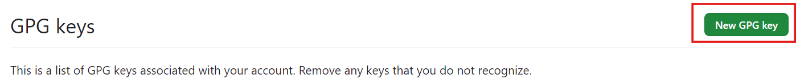
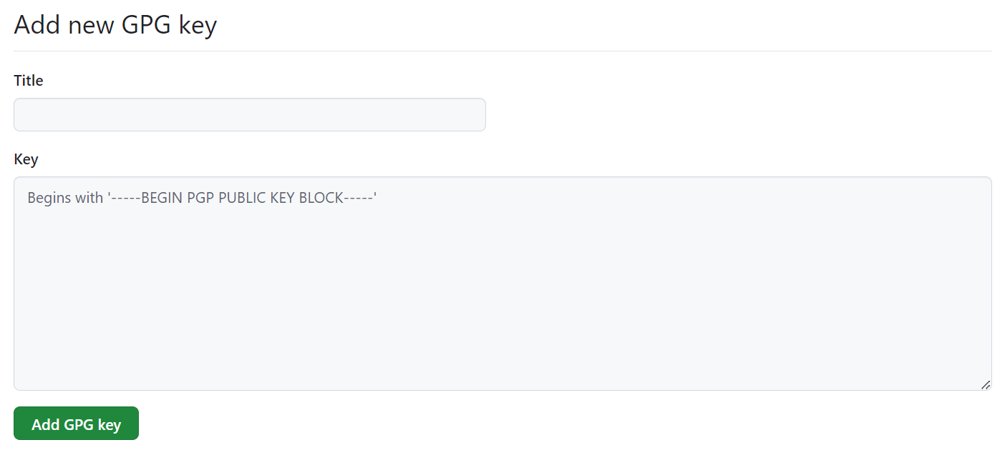

## 設問

`Github` への `GPGキー` の登録を行うマニュアルを `manual` ディレクトリに `Markdown` 文書として格納してください。

## 回答

### 1. GPGキーの確認

1. WindowsではGit Bashを、macOS/Linuxではターミナルを起動します。

2. 以下のコマンドを実行して、登録するGPGキーのIDを確認します。

    ```
    gpg --list-secret-keys --keyid-format=long
    ```

3. 出力から、使用したいキーのIDをメモします。`./4-answer.md` のマニュアルに沿ってキーを作成している場合、例の `67983FDC1DEB3ACB` の箇所となります。(本マニュアルではセキュリティ上サブキーを使用します)

    ```
    $ gpg --list-secret-keys --keyid-format=long
    /Users/hubot/.gnupg/secring.gpg
    ------------------------------------
    sec   ed25519/3AA5C34371567BD2 2016-03-10 [SC]
    uid                          Hubot <hubot@example.com>
    ssb   cv25519/4BB6D45482678BE3 2016-03-10 [E]
    ssb   ed25519/67983FDC1DEB3ACB 2016-03-10 [S]
    ```

### 2. GPG公開鍵のエクスポート

1. 以下のコマンドを実行して、GPG公開鍵をエクスポートします。`<YOUR_KEY_ID>`を先ほどメモしたキーIDに置き換えてください。

    ```
    gpg --armor --export <YOUR_KEY_ID>
    ```

2. 表示された`-----BEGIN PGP PUBLIC KEY BLOCK-----`から`-----END PGP PUBLIC KEY BLOCK-----`までの全テキストをコピーします。

## 3. GitHubへのGPGキーの追加

1. GitHubにログインし、ページの右上のセクションに移動。プロフィール写真をクリックして、「Settings」を選択します。

    

    

2. 左側のサイドバーで「SSH and GPG keys」をクリックします。

    

3. `GPG keys`セクションで、`New GPG key`ボタンをクリックします。

    

4. 「Add new GPG key」の各欄にそれぞれ記入していきます。

    

    - 「Title」フィールドに、キーを識別するための名前を入力します（名前は任意のもので大丈夫です）。

    - `Key`フィールドに、先ほどコピーしたGPG公開鍵を貼り付けます。

    - `Add GPG key`ボタンをクリックして保存します。

    - GitHubパスワードの確認を求められた場合は入力します。

これで、GitHub への `GPGキー` の登録が完了しました。


### 注意事項

- 登録したGPGキーを使用するには下記のコマンドを実行する必要があります。詳細は参考URLの記事より。

  ```
  git config --global commit.gpgsign true
  git config --global user.signingkey <YOUR_KEY_ID>
  ```

- 署名付きコミットを行う際に下記のようなエラーが起こる場合があります。その際は`~/.bashrc`などの設定ファイルの末尾に`export GPG_TTY=$(tty)` を追記して `source ~/.bashrc` を実行してください。

  ```
  error: gpg failed to sign the data
  fatal: failed to write commit object
  ```

### 参考URL

[GitHub Docs (Git へ署名キーを伝える)](https://docs.github.com/ja/authentication/managing-commit-signature-verification/telling-git-about-your-signing-key)

[Qiita (GitHub のGPG署名を EdDSA にしてみる)](https://qiita.com/nothink/items/4d969dc00eae7cad81ed)

[tips-jp (WSLのgitでGPG署名を付ける場合に"gpg failed to sign the data"となる場合の解決方法)](https://kazkobara.github.io/tips-jp/linux/gpg_failed_to_sign_the_data_in_git_on_wsl.html)
